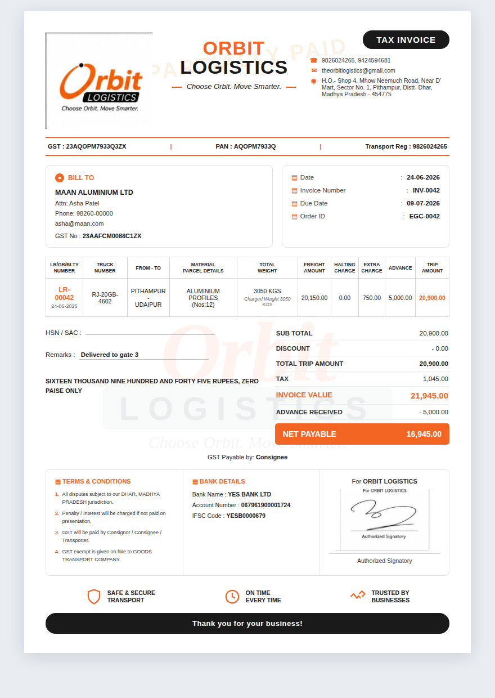
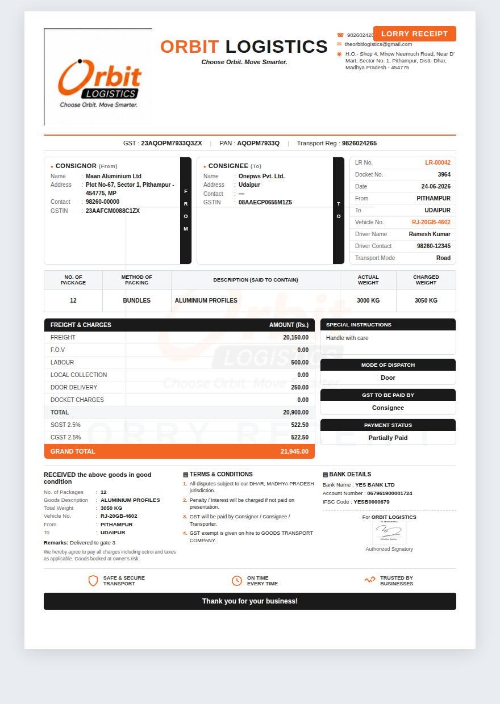

# Orbit Logistics

A production-grade **transport ERP** for road-freight businesses — built for Express Goods Carrier (EGC), Pithampur, Madhya Pradesh, India.

Orbit takes a load from **Quote → Order → Invoice → Lorry Receipt (LR/Bilty) → Accounting → Reports**, with a built-in AI business partner (**Orbit AI**) that understands the screen you're on, explains accounting in plain language, and proactively surfaces what needs attention — without ever fabricating a number or bypassing security.

> **Status:** feature-complete and extensively tested offline. Live deployment verification is required before production use — see the [Production Deployment Checklist](#production-deployment-checklist).

---

## Table of contents

- [Highlights](#highlights)
- [Architecture](#architecture)
- [Folder structure](#folder-structure)
- [Prerequisites](#prerequisites)
- [Installation & local run](#installation--local-run)
- [Firebase setup](#firebase-setup)
- [Gemini API setup (Orbit AI)](#gemini-api-setup-orbit-ai)
- [Deployment](#deployment)
- [Testing](#testing)
- [Screenshots](#screenshots)
- [Troubleshooting](#troubleshooting)
- [Known limitations](#known-limitations)
- [Production deployment checklist](#production-deployment-checklist)
- [Documents](#documents)
- [License](#license)

---

## Highlights

**Core ERP**
- Customer quote requests → owner approval → automatic order, invoice, LR and accounting entries.
- Owner **manual orders** for phone bookings (bypasses the customer quote flow, same canonical pipeline).
- **Lorry Receipt (LR/Bilty)** with E-Way Bill fields, delivery acknowledgement and signature/seal area.
- GST-aware invoicing (SGST/CGST), advances, part-payments, halting/FOV/labour and other transport charges.

**Double-entry accounting** (no jargon for the owner)
- Chart of Accounts, auto-posting on order approval and payment.
- Customer Ledger, Outstanding (with ageing buckets), Sales/Purchase Register, Cash & Bank Book, Trial Balance, P&L, Balance Sheet.
- Plain-language vouchers: **Receive Payment**, **Make Payment**, **Cash ↔ Bank** — with human confirmations ("✓ ₹2,500 paid for Fuel & Diesel — saved.").

**Orbit AI — an AI business partner, not a chatbot**
- Secure server-side (Cloud Functions); the Gemini key never reaches the client and the AI never bypasses Firestore rules.
- Adaptive tone (casual ↔ teacher ↔ consultant ↔ ERP operator ↔ mentor) with four invariants that never relax: honesty about being an AI, never fabricate data, security absolute, confirm before any state change.
- **Morning Brief**, **Business Health Score**, proactive **page insights** ("you have ₹4.2 lakh outstanding; chase Acme first"), **"Explain like I'm new"** accounting help.
- Remembers harmless patterns (e.g. a customer's last route) to offer one-click prefills — never auto-filled, always confirmed.

**Single Source of Truth (SSoT)**
- The **Order document** is the master. Invoice, LR, Accounting, Reports and Excel all *project* from it — never parallel state.

---

## Architecture

```
                         ┌─────────────────────────────┐
   Browser (vanilla JS)  │  index / dashboards / accounting (HTML+JS)  │
   window-namespaced     │  EGC INV LR SHIP OWN CUST DASH CO ACC TOS    │
   globals, realtime      └───────────────┬─────────────────────────────┘
   onSnapshot                              │ Firebase Web SDK (compat)
                                           ▼
                         ┌─────────────────────────────┐
        Firestore        │  orders (SSoT) · invoices · lorryReceipts ·  │
        + Auth + Rules   │  quotes · journalEntries · accounts · parties│
                         └───────────────┬─────────────────────────────┘
                                         │ callable (verified ID token)
                                         ▼
                         ┌─────────────────────────────┐
     Cloud Functions     │  orbitAI · orbitMorningBrief · orbitInsight  │
     (Node 20)           │  data-access (security boundary) · tools ·   │
                         │  accounting-bridge (real ACC engine in a vm) │
                         └───────────────┬─────────────────────────────┘
                                         │ server-side only
                                         ▼
                                   Gemini API
```

Key principles: **SSoT**, no duplicated logic, no fabricated numbers, security before convenience, explain before acting, confirmation before mutation.

- **Frontend:** vanilla JavaScript, window-namespaced modules, Firestore realtime listeners, `window.print` for PDFs. No build step.
- **Charge model:** `shipment.js` (`SHIP.computeCharges`) is canonical; `toInvoiceView` / `toLrView` / `toAccountingRow` are projections.
- **Accounting:** `acc-core` / `acc-ledgers` / `acc-posting` derive every report from journal entries.
- **AI:** Cloud Functions verify the caller's token, derive role from the verified email, and call only role-scoped tools. The accounting bridge loads the **real** accounting source in a sandbox so AI figures are byte-identical to the UI.

---

## Folder structure

```
.
├── EGC-Logistics-System/          # the web app
│   ├── index.html                 # marketing / entry
│   ├── auth.js / auth.css         # authentication
│   ├── dashboard.html/.js         # customer dashboard
│   ├── owner-dashboard.html/.js   # owner dashboard
│   ├── accounting.html            # accounting workspace
│   ├── acc-*.js                   # accounting engine + UI
│   ├── shipment.js                # canonical charge model (SSoT projections)
│   ├── invoice.js / lr.js         # invoice & Lorry Receipt rendering
│   ├── companies.js               # company directory + recall
│   ├── orbit-ai.js/.css           # Orbit AI client widget
│   ├── phase3-core.js / phase3.css
│   ├── firebase-config.example.js # copy → firebase-config.js
│   ├── firebase.json / firestore.rules / firestore.indexes.json
│   ├── .firebaserc.example        # copy → .firebaserc
│   ├── functions/                 # Cloud Functions (Orbit AI backend)
│   │   ├── index.js               # callables: orbitAI / orbitMorningBrief / orbitInsight
│   │   ├── data-access.js         # the security boundary
│   │   ├── tools.js               # role-scoped AI tools
│   │   ├── accounting-bridge.js   # loads real ACC engine in a vm sandbox
│   │   ├── context.js / morning-brief.js / page-insight.js
│   │   ├── sync-vendor.js         # copies ACC source into functions/vendor (predeploy)
│   │   └── test/                  # functions unit tests
│   └── docs/screenshots/          # design previews (README screenshots)
├── qa/                            # offline test suites (Node + Playwright)
├── README.md
├── CHANGELOG.md / RELEASE_NOTES.md / CONTRIBUTING.md / SECURITY.md / LICENSE
└── .gitignore
```

---

## Prerequisites

- **Node.js 20+** (Cloud Functions target Node 20).
- A **Firebase project** on the **Blaze** plan (Cloud Functions + outbound network to Gemini require Blaze).
- **Firebase CLI:** `npm install -g firebase-tools`
- A **Google Gemini API key** (for Orbit AI).
- For local static hosting: any static server (e.g. `npx serve`, the Firebase emulator, or VS Code Live Server).

---

## Installation & local run

```bash
# 1. Clone
git clone <your-repo-url> orbit-logistics
cd orbit-logistics/EGC-Logistics-System

# 2. Create local config from the templates
cp firebase-config.example.js firebase-config.js     # then fill in your Firebase web config
cp .firebaserc.example .firebaserc                   # then set your project id

# 3. Serve the static app (any static server works)
npx serve .            # or: firebase emulators:start --only hosting

# 4. (Orbit AI) install function deps
cd functions
npm install
```

> `firebase-config.js` and `.firebaserc` are git-ignored on purpose — they hold your project's values and should never be committed.

The owner account is identified by a hard-coded email (the EGC owner). **If you are deploying for a different business, search the codebase for the owner email and replace it** (it appears in `firestore.rules`, `functions/index.js`, `orbit-ai.js`, `phase3-core.js` and the AI tests). This email is the owner/customer security boundary.

---

## Firebase setup

1. Create a project in the [Firebase Console](https://console.firebase.google.com/) and upgrade to **Blaze**.
2. Enable **Authentication** (Email/Password) and **Firestore** (production mode).
3. In Project settings → *Your apps*, register a **Web app** and copy the config into `firebase-config.js`.
4. Set your project id in `.firebaserc`.
5. Deploy rules and indexes:
   ```bash
   firebase deploy --only firestore:rules,firestore:indexes
   ```
   `firestore.rules` enforces the owner/customer boundary; `firestore.indexes.json` covers the composite queries the dashboards use.

---

## Gemini API setup (Orbit AI)

Orbit AI runs **only** on the server. The key is never shipped to the browser.

```bash
cd EGC-Logistics-System/functions

# Option A — Firebase functions config (classic)
firebase functions:config:set gemini.key="YOUR_GEMINI_API_KEY"

# Option B — environment variable (e.g. .env for 2nd-gen / local emulation)
echo 'GEMINI_KEY=YOUR_GEMINI_API_KEY' > .env      # .env is git-ignored
```

The code reads `functions.config().gemini.key` first, then `process.env.GEMINI_KEY`.
If no key is configured, the app still works — Orbit AI's proactive features degrade gracefully (the client renders structured fallbacks; nothing errors).

> If a key is ever exposed, rotate it immediately in Google AI Studio / Google Cloud. No source file depends on a specific key value.

---

## Deployment

```bash
cd EGC-Logistics-System

# 1. Functions vendor sync runs automatically as a predeploy hook,
#    but you can run it manually:
node functions/sync-vendor.js

# 2. Deploy everything (hosting + functions + rules + indexes)
firebase deploy

# …or piecemeal:
firebase deploy --only hosting
firebase deploy --only functions
firebase deploy --only firestore:rules,firestore:indexes
```

Functions are pinned to region **us-central1**. After deploy, run the in-browser security spot-checks in [`ORBIT-AI.md`](EGC-Logistics-System/ORBIT-AI.md).

---

## Testing

All suites run offline (Firestore is mocked; Playwright + Chromium drive the UI). From the repo root:

```bash
# Cloud Functions logic (sync the accounting vendor first)
node EGC-Logistics-System/functions/sync-vendor.js
node EGC-Logistics-System/functions/test/orbit-ai.test.js
node EGC-Logistics-System/functions/test/morning-brief.test.js
node EGC-Logistics-System/functions/test/page-insight.test.js

# App logic + UI (run from qa/)
cd qa
node e2e.js          # end-to-end pipeline
node edge.js         # edge cases
node regression.js   # cross-phase regression
node ui.js           # owner/customer UI (Playwright)
node ui-ai.js        # Orbit AI UI (Playwright)
node ui-accounting.js# accounting UX (Playwright)
```

Playwright/Chromium must be available on the machine for the `ui*.js` suites.

---

## Screenshots

Design previews live in [`EGC-Logistics-System/docs/screenshots/`](EGC-Logistics-System/docs/screenshots/):

| Invoice (SSoT) | Lorry Receipt (SSoT) |
| --- | --- |
|  |  |

_Add live app screenshots (dashboard, accounting, Orbit AI) here as you capture them._

---

## Troubleshooting

| Symptom | Likely cause / fix |
| --- | --- |
| Blank screen after login | Ensure `firebase-config.js` exists and has valid values (copy from `.example`). |
| "Missing or insufficient permissions" | Deploy `firestore.rules`; confirm the signed-in email matches the configured owner for owner-only data. |
| Orbit AI says nothing / errors | Confirm the Gemini key is set in functions config/env and functions are deployed to `us-central1`. Without a key, proactive features fall back silently by design. |
| Functions deploy fails on accounting bridge | Run `node functions/sync-vendor.js` (regenerates `functions/vendor/`). |
| Composite-index error in console | Deploy `firestore.indexes.json`, or click the console link to create the missing index. |
| PDFs don't open | Allow pop-ups for the app's domain (`window.print` opens a print view). |
| Customer sees no shipment | Expected for a customer with no orders; the UI shows a guiding empty state. |

---

## Known limitations

- **Live verification still required.** All testing here is offline (mocked Firestore, no live Gemini). The real model "feel," live callable round-trips, and concurrent-edit behavior must be verified on a deployed build.
- **Owner identity is an email constant**, not yet a configurable setting (must be edited in source for a new business).
- **TDS tracking** activates only once a TDS account exists in the Chart of Accounts (the Morning Brief reports TDS *only* when real data exists — it never fabricates it).
- **Order ↔ accounting payment sync** is offered as a one-click action after a linked receipt; it is not automatic for free-standing receipts (mapping would be ambiguous).
- **No build/bundler step** — intentional simplicity; the app is plain ES5-style JS served statically.
- **Roadmap (not built):** WhatsApp/email reminder *sending*, payment-date prediction, cash-flow forecasting, response streaming.

---

## Production deployment checklist

- [ ] Firebase project on **Blaze**; Auth (Email/Password) and Firestore enabled.
- [ ] `firebase-config.js` and `.firebaserc` created from templates with real values (and **not** committed).
- [ ] Owner email replaced consistently across `firestore.rules`, `functions/index.js`, `orbit-ai.js`, `phase3-core.js`, and AI tests (if not EGC).
- [ ] `firestore.rules` and `firestore.indexes.json` deployed.
- [ ] Gemini key configured server-side (`functions:config:set gemini.key=…` or `GEMINI_KEY`); **rotate any key that was ever pasted in chat or committed.**
- [ ] `node functions/sync-vendor.js` succeeds; `firebase deploy` completes.
- [ ] In-browser **owner** spot-check: can see all data, Morning Brief and insights work.
- [ ] In-browser **customer** spot-check: sees only own shipments/invoices; cannot reach other parties, accounting, or reports.
- [ ] Orbit AI refuses to fabricate figures and asks for confirmation before any state change.
- [ ] Replace the UDYAM registration placeholder in `invoice.js` with the real number.
- [ ] All test suites green against the current build.
- [ ] Pop-ups allowed for PDF print views on the production domain.

---

## Documents

- [`ORBIT-AI.md`](EGC-Logistics-System/ORBIT-AI.md) — Orbit AI deployment & verification guide.
- [`CHANGELOG.md`](CHANGELOG.md) — version history.
- [`RELEASE_NOTES.md`](RELEASE_NOTES.md) — this release.
- [`CONTRIBUTING.md`](CONTRIBUTING.md) — how to contribute.
- [`SECURITY.md`](SECURITY.md) — security policy & reporting.

---

## License

Released under the MIT License — see [`LICENSE`](LICENSE).
